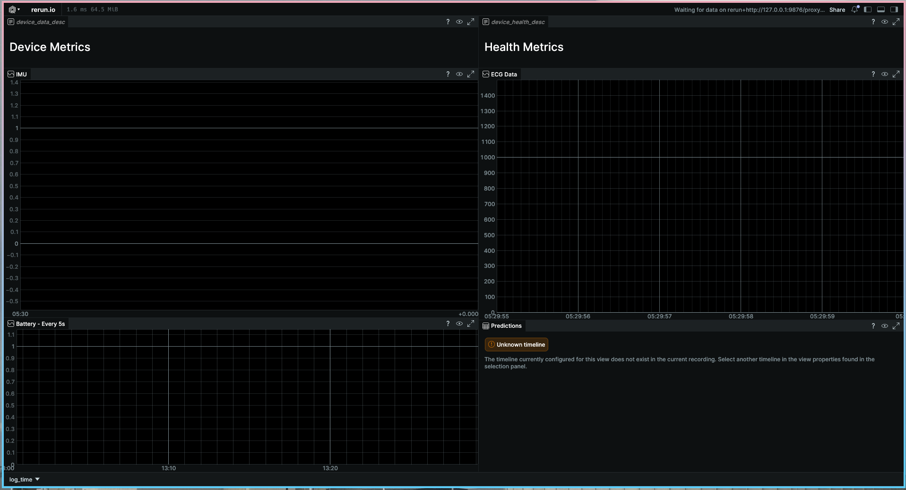
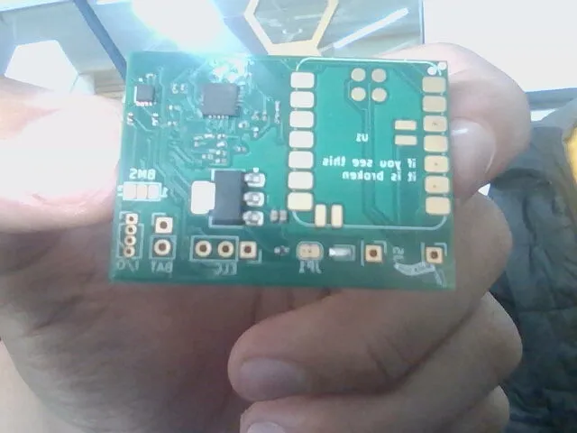

# Main Repo
> For Blueprint Reviewers, [Final Version](Hardware/CAD/the_last_one.step) is what our end model is. Design is goose.f3d present in the same file. BOM is present in root dir, table format (bottom of readme) and PCB folder. PCB Folder contains gerbers.zip and design files. Firmware is in [firmware](src) and software in [software](scripts). Everything else is in ML or doc. Check [Sections](#sections) for descriptions. thank you for reviewing our project :)

This is the main repo for the Arryhtmix Project, which aims to develop a novel, end-to-end framework for
the prediction of cardiac events
>
> We have developed a novel end to end pipeline for the prediction of cardiac arrests through machine learning alongside a medical device to facilitate the collection of data for the model.
>
>The initial process takes place on the device. The single-lead AD8232 Sensor with integrated hardware high pass and low pass filters collects ECG Data from one lead with one electrode for common mode rejection. The data is read at a rate of 360 Hz by the nRF52840 using a 12-bit ADC and concurrently denoised through an integrated LSM6DS3. While the device is idle, it is kept in deep sleep mode, significantly reducing power consumption.
>Upon the collection of 10 data points, the buffer is dispatched using BLE to the host device.
>
>Upon being dispatched to the host device, two models are run on it. First, an Arrhythmia classification model based on the MIT-BIH dataset and architected with a BiLSTM and Random Forest classifier returns a dataclass which describes the type of arrhythmia if any. Secondly, a novel model based on the Sudden Cardiac Arrest Holter Database architected by DAKSH EXPLAIN HERE is implemented. This provides  a set of “risk classes” which give the probability of a heart attack happening in the specified timeframe. A f-score of 99 percent and of 85 percent is obtained from both models respectively.
> - ISEF Abstract
### Sections
- [Scripts](scripts)
  - [Miscellaneous](scripts/misc)
    - mixture of normal and vibecoded scripts made for testing
  - [Rerun](scripts/rerun)
    - Scripts and Blueprints for the [Rerun](https://rerun.io) visualizer
- [Hardware](Hardware)
  - [PCB Documents](Hardware/PCB)
  - [CAD Files](Hardware/CAD)
    - all of these are from some iteration or the other, but they should represent the totality of our cad.
    - [Final Version](Hardware/CAD/the_last_one.step) is what our end model is. Design is goose.f3d present in the same file
- [Firmware](src)
  - firmware for the device
- [ML](ML)
  - Our own model training stuff, and tweaked versions of other's
- [Documentation](Doc) 
  - Extra stuff relating to the project. Will add slide decks soon:tm:
### Images 

 
    
 
    
 

 

## BOM
| JLCPCB BOM Tool - BOM Matching           |                   |                    |                                                                |               |                    |                    |                                                                                                                                                           |               |                                                                                                                                                                                  |                                                            |                                                                                                                       |                   |                                                                           |          |     |           |                 |
|------------------------------------------|-------------------|--------------------|----------------------------------------------------------------|---------------|--------------------|--------------------|-----------------------------------------------------------------------------------------------------------------------------------------------------------|---------------|----------------------------------------------------------------------------------------------------------------------------------------------------------------------------------|------------------------------------------------------------|-----------------------------------------------------------------------------------------------------------------------|-------------------|---------------------------------------------------------------------------|----------|-----|-----------|-----------------|
| BOM name：bom-JLCPCB Assembly Order.xlsx |                   |                    | Download Time：2025-12-03 19:28:29                             |               |                    |                    | * Our matching results are updated in real-time, but stock and prices may change.  If it's been over 24 hours, please re-match before placing your order. |               |                                                                                                                                                                                  |                                                            |                                                                                                                       |                   |                                                                           |          |     |           |                 |
| PCB Assembled Qty：5                     |                   |                    | Est. Total Price：11.8136                                      |               |                    |                    |                                                                                                                                                           |               |                                                                                                                                                                                  |                                                            |                                                                                                                       |                   |                                                                           |          |     |           |                 |
| Your BOM                                 |                   |                    |                                                                |               | Matched Parts      |                    |                                                                                                                                                           |               |                                                                                                                                                                                  |                                                            |                                                                                                                       | Order Information |                                                                           |          |     |           |                 |
| Top Designator                           | Bottom Designator | Comment            | Footprint                                                      | JLCPCB Part # | Matches            | Part #             | Manufacturer                                                                                                                                              | Footprint     | Description                                                                                                                                                                      | Category                                                   | Warning                                                                                                               | JLCPCB Part #     | Product link                                                              | Lib Type | Qty | Source    | Total Price ($) |
| C2                                       |                   | 1nF                | C_0201_0603Metric                                              |               | Select by Customer | 0201B102K500NT     | FH (Guangdong Fenghua Advanced Tech)                                                                                                                      | 0201          | 1nF 50V X7R ±10% 0201 Multilayer Ceramic Capacitors MLCC - SMD/SMT ROHS                                                                                                          | Multilayer Ceramic Capacitors MLCC - SMD/SMT               |                                                                                                                       | C66942            | https://jlcpcb.com/partdetail/68029-0201B102K500NT/C66942                 | Extended | 20  | 20 JLCPCB | 0.014           |
| C5                                       |                   | 1.5nF              | C_0201_0603Metric                                              |               | Select by Customer | GRM033R71C152KA01D | Murata Electronics                                                                                                                                        | 0201          | 1.5nF 16V X7R ±10% 0201 Multilayer Ceramic Capacitors MLCC - SMD/SMT ROHS                                                                                                        | Multilayer Ceramic Capacitors MLCC - SMD/SMT               |                                                                                                                       | C161482           | https://jlcpcb.com/partdetail/172863-GRM033R71C152KA01D/C161482           | Extended | 20  | 20 JLCPCB | 0.05            |
| C6                                       |                   | 10nF               | C_0201_0603Metric                                              |               | Select by Customer | GRM033R61E103KA12D | Murata Electronics                                                                                                                                        | 0201          | 10nF 25V X5R ±10% 0201 Multilayer Ceramic Capacitors MLCC - SMD/SMT ROHS                                                                                                         | Multilayer Ceramic Capacitors MLCC - SMD/SMT               |                                                                                                                       | C76938            | https://jlcpcb.com/partdetail/MurataElectronics-GRM033R61E103KA12D/C76938 | Extended | 20  | 20 JLCPCB | 0.036           |
| C7,C1                                    |                   | 0.33uF             | C_0201_0603Metric                                              |               | Select by Customer | GRM033R61E334KE15D | Murata Electronics                                                                                                                                        | 0201          | 25V 330nF ±10% 0201 Multilayer Ceramic Capacitors MLCC - SMD/SMT ROHS                                                                                                            | Multilayer Ceramic Capacitors MLCC - SMD/SMT               | 1.The comment (GRM033R61E334KE15D) of this part does not match the one (0.33uF) provided in your BOM. Please confirm; | C723889           | https://jlcpcb.com/partdetail/768943-GRM033R61E334KE15D/C723889           | Extended | 20  | 20 JLCPCB | 0.388           |
| C8,C9                                    |                   | 10uF               | C_0402_1005Metric                                              |               | Select by System   | CL05A106MQ5NUNC    | Samsung Electro-Mechanics                                                                                                                                 | 0402          | 10uF 6.3V X5R ±20% 0402 Multilayer Ceramic Capacitors MLCC - SMD/SMT ROHS                                                                                                        | Multilayer Ceramic Capacitors MLCC - SMD/SMT               |                                                                                                                       | C15525            | https://jlcpcb.com/partdetail/16204-CL05A106MQ5NUNC/C15525                | Basic    | 20  | 20 JLCPCB | 0.09            |
| C10,C4,C3                                |                   | 0.1uF              | C_0201_0603Metric                                              |               | Select by Customer | CL03A104KP3NNNC    | Samsung Electro-Mechanics                                                                                                                                 | 0201          | 100nF 10V X5R ±10% 0201 Multilayer Ceramic Capacitors MLCC - SMD/SMT ROHS                                                                                                        | Multilayer Ceramic Capacitors MLCC - SMD/SMT               | 1.The comment (CL03A104KP3NNNC) of this part does not match the one (0.1uF) provided in your BOM. Please confirm;     | C49062            | https://jlcpcb.com/partdetail/50070-CL03A104KP3NNNC/C49062                | Extended | 20  | 20 JLCPCB | 0.026           |
| D1                                       |                   | LED                | LED_0603_1608Metric                                            |               | Unconfirmed        | KT-0603R           | Hubei KENTO Elec                                                                                                                                          | 0603          | -40℃~+85℃ 120° 2.4V 20mA 300mcd 40mW 615nm~630nm 645nm Red Water Clear 0603 LED Indication - Discrete ROHS                                                                       | LED Indication - Discrete                                  | 1.The comment (KT-0603R) of this part does not match the one (LED) provided in your BOM. Please confirm;              | C2286             | https://jlcpcb.com/partdetail/Hubei_KENTOElec-KT0603R/C2286               | Basic    | 20  | 20 JLCPCB | 0.112           |
| R1,R4,R7,R5,R6,R15                       |                   | 10M惟              | R_0201_0603Metric                                              |               | Select by Customer | RTT01106JTH        | RALEC                                                                                                                                                     | 0201          | -55℃~+125℃ 10MΩ 25V 50mW Thick Film Resistor ±200ppm/℃ ±5% 0201 Chip Resistor - Surface Mount ROHS                                                                               | Chip Resistor - Surface Mount                              | 1.The comment (RTT01106JTH) of this part does not match the one (10M惟) provided in your BOM. Please confirm;         | C158867           | https://jlcpcb.com/partdetail/RALEC-RTT01106JTH/C158867                   | Extended | 22  | 22 JLCPCB | 0.0198          |
| R3,R2                                    |                   | 180k惟             | R_0201_0603Metric                                              |               | Select by Customer | RTT01184JTH        | RALEC                                                                                                                                                     | 0201          | -55℃~+125℃ 180kΩ 25V 50mW Thick Film Resistor ±200ppm/℃ ±5% 0201 Chip Resistor - Surface Mount ROHS                                                                              | Chip Resistor - Surface Mount                              | 1.The comment (RTT01184JTH) of this part does not match the one (180k惟) provided in your BOM. Please confirm;        | C158738           | https://jlcpcb.com/partdetail/RALEC-RTT01184JTH/C158738                   | Extended | 20  | 20 JLCPCB | 0.068           |
| R8                                       |                   | 360k               | R_0201_0603Metric                                              |               | Select by Customer | RTT01364JTH        | RALEC                                                                                                                                                     | 0201          | -55℃~+125℃ 25V 360kΩ 50mW Thick Film Resistor ±200ppm/℃ ±5% 0201 Chip Resistor - Surface Mount ROHS                                                                              | Chip Resistor - Surface Mount                              | 1.The comment (RTT01364JTH) of this part does not match the one (360k) provided in your BOM. Please confirm;          | C158574           | https://jlcpcb.com/partdetail/RALEC-RTT01364JTH/C158574                   | Extended | 20  | 20 JLCPCB | 0.022           |
| R9,R13,R14                               |                   | 1M惟               | R_0201_0603Metric                                              |               | Select by Customer | RTT011004FTH       | RALEC                                                                                                                                                     | 0201          | -55℃~+125℃ 1MΩ 25V 50mW Thick Film Resistor ±1% ±200ppm/℃ 0201 Chip Resistor - Surface Mount ROHS                                                                                | Chip Resistor - Surface Mount                              | 1.The comment (RTT011004FTH) of this part does not match the one (1M惟) provided in your BOM. Please confirm;         | C102686           | https://jlcpcb.com/partdetail/RALEC-RTT011004FTH/C102686                  | Extended | 20  | 20 JLCPCB | 0.018           |
| R12                                      |                   | 100k惟             | R_0201_0603Metric                                              |               | Select by Customer | CR0201FH1003G      | LIZ Elec                                                                                                                                                  | 0201          | -55℃~+125℃ 100kΩ 25V 50mW Thick Film Resistor ±1% ±250ppm/℃ 0201 Chip Resistor - Surface Mount ROHS                                                                              | Chip Resistor - Surface Mount                              | 1.The comment (CR0201FH1003G) of this part does not match the one (100k惟) provided in your BOM. Please confirm;      | C100127           | https://jlcpcb.com/partdetail/LIZElec-CR0201FH1003G/C100127               | Extended | 20  | 20 JLCPCB | 0.016           |
| R16                                      |                   | 1.4m惟             | R_0201_0603Metric                                              |               | Select by Customer | 0201WMF1404TEE     | UNI-ROYAL(Uniroyal Elec)                                                                                                                                  | 0201          | -55℃~+155℃ 1.4MΩ 25V 50mW Thick Film Resistor ±1% ±200ppm/℃ 0201 Chip Resistor - Surface Mount ROHS                                                                              | Chip Resistor - Surface Mount                              |                                                                                                                       | C423737           | https://jlcpcb.com/partdetail/416687-0201WMF1404TEE/C423737               | Extended | 20  | 20 JLCPCB | 0.028           |
| R19                                      |                   | 1k                 | R_0402_1005Metric                                              |               | Select by Customer | 0402WGF1001TCE     | UNI-ROYAL(Uniroyal Elec)                                                                                                                                  | 0402          | -55℃~+155℃ 1kΩ 50V 62.5mW Thick Film Resistor ±1% ±100ppm/℃ 0402 Chip Resistor - Surface Mount ROHS                                                                              | Chip Resistor - Surface Mount                              | 1.The comment (0402WGF1001TCE) of this part does not match the one (1k) provided in your BOM. Please confirm;         | C11702            | https://jlcpcb.com/partdetail/12256-0402WGF1001TCE/C11702                 | Basic    | 20  | 20 JLCPCB | 0.012           |
| R21,R20                                  |                   | 2.2K               | R_0402_1005Metric                                              |               | Select by Customer | 0402WGF2201TCE     | UNI-ROYAL(Uniroyal Elec)                                                                                                                                  | 0402          | -55℃~+155℃ 2.2kΩ 50V 62.5mW Thick Film Resistor ±1% ±100ppm/℃ 0402 Chip Resistor - Surface Mount ROHS                                                                            | Chip Resistor - Surface Mount                              | 1.The comment (0402WGF2201TCE) of this part does not match the one (2.2K) provided in your BOM. Please confirm;       | C25879            | https://jlcpcb.com/partdetail/26622-0402WGF2201TCE/C25879                 | Basic    | 20  | 20 JLCPCB | 0.012           |
| U2                                       |                   | AD8232             | LFCSP_20                                                       |               | Unconfirmed        | AD8232ACPZ-R7      | Analog Devices                                                                                                                                            | LFCSP-20(4x4) | -40℃~+85℃ 12ppm/℃ 170uA 2V~3.5V LFCSP-20(4x4) Analog Front End (AFE) ROHS                                                                                                        | Analog To Digital Converters (ADC)                         | 1.The comment (AD8232ACPZ-R7) of this part does not match the one (AD8232) provided in your BOM. Please confirm;      | C43216            | https://jlcpcb.com/partdetail/AnalogDevices-AD8232ACPZR7/C43216           | Extended | 2   | 2 JLCPCB  | 5.715           |
| U3                                       |                   | NCP1117-3.3_SOT223 | SOT-223-3_TabPin2                                              |               | Select by Customer | AMS1117-3.3        | Advanced Monolithic Systems                                                                                                                               | SOT-223       | -40℃~+125℃ 0.003%Vout 1 1.1V@(800mA) 16V 1A 3.3V 5mA 72dB@(120Hz) Fixed Over Current Protection Positive SOT-223 Voltage Regulators - Linear, Low Drop Out (LDO) Regulators ROHS | Voltage Regulators - Linear, Low Drop Out (LDO) Regulators |                                                                                                                       | C6186             | https://jlcpcb.com/partdetail/Advanced_MonolithicSystems-AMS1117_33/C6186 | Basic    | 2   | 2 JLCPCB  | 0.3178          |
| U4                                       |                   | MAX17048G_T10      | SON50P200X200X80-9N                                            |               | Select by System   | MAX17048G+T10      | Analog Devices Inc./Maxim Integrated                                                                                                                      | DFN-8-EP(2x2) | -40℃~+85℃ 1 2.5V~4.5V 3uA I2C Lithium Battery Not Supported Not Supported DFN-8-EP(2x2) Battery Management ROHS                                                                  | Battery Management                                         |                                                                                                                       | C2682616          | https://jlcpcb.com/partdetail/2777647-MAX17048GT10/C2682616               | Extended | 2   | 2 JLCPCB  | 4.869           |
| J1                                       |                   | DNP                | PinSocket_1x04_P1.27mm_Vertical                                |               | No matches         | No Part Selected   |                                                                                                                                                           |               |                                                                                                                                                                                  |                                                            |                                                                                                                       |                   |                                                                           |          |     |           |                 |
| J2                                       |                   | DNP                | PinSocket_1x02_P2.54mm_Vertical                                |               | No matches         | No Part Selected   |                                                                                                                                                           |               |                                                                                                                                                                                  |                                                            |                                                                                                                       |                   |                                                                           |          |     |           |                 |
| J3                                       |                   | DNP                | PinHeader_1x03_P2.54mm_Vertical                                |               | No matches         | No Part Selected   |                                                                                                                                                           |               |                                                                                                                                                                                  |                                                            |                                                                                                                       |                   |                                                                           |          |     |           |                 |
| SW1                                      |                   | SW_SPST            | SW_DIP_SPSTx01_Slide_6.7x4.1mm_W6.73mm_P2.54mm_LowProfile_JPin |               | No matches         | No Part Selected   |                                                                                                                                                           |               |                                                                                                                                                                                  |                                                            |                                                                                                                       |                   |                                                                           |          |     |           |                 |
| U1                                       |                   | XIAO-nRF52840-SMD  | XIAO-nRF52840-SMD                                              |               | No matches         | No Part Selected   |                                                                                                                                                           |               |                                                                                                                                                                                  |                                                            |                                                                                                                       |                   |                                                                           |          |     |           |                 |